# PurrView - android memory-safety conference lab

PurrView is a small, visible Android application for an on-stage memory-safety
demonstration. Native decoder workers run in package-owned isolated processes, so a
fault leaves the activity on screen for the next experiment.     

Every input is bundled with the APK and every parser belongs to PurrView. The
project does not request telephony permissions, open the Android SMS provider,
touch another application, use `ptrace`, open a socket, or execute a payload.
The calculator button is an ordinary, explicit Android intent that is separate
from all native parser control flow.     

## what the demos prove

### PNG parser (on-device, deterministic)

`purrview-oob.png` is a valid PNG envelope containing an inert `pCAT` ancillary
chunk. Its IHDR describes `128 × 128` RGBA8 pixels, so the required copy is
`65,536` bytes. The intentionally vulnerable PurrView policy narrows that value
to 16 bits, obtains an allocation of one byte, and calls `memcpy` with the
full 65,536-byte length. It logs the destination, source and length and then
raises `SIGABRT` before the corrupted heap can be reused. This gives a real,
repeatable OOB write in PurrView's `:png_decoder` process, while the main UI
remains alive.

`Run fixed` allocates and copies the same 65,536 bytes with a 64-bit checked
size and returns `FIXED SAFE`. `Run PoC` takes the vulnerable path. The parser
is deliberately limited to this fixture; it is not Android's system PNG
decoder.

### WebP control and historical fixture

The APK vendors libwebp 1.3.1 and calls its real `WebPGetFeatures` and
`WebPDecodeRGBAInto` entry points in `:webp_decoder`. `bad.webp` is the
236-byte VP8L sample from the local fuzzing lab (SHA-256
`34f3ca760640a63c321d98267a029e8c918f434ca9a30dbf6fe1adab65d63a63`). On an
ARM release build the decoder may reject it cleanly; that is a valid device
outcome. The primary memory-safety evidence is the host ASan run, which
reaches `src/utils/huffman_utils.c:59` in libwebp 1.3.1. The APK never claims
that a clean Android return is code execution.

### JPEG/PGM control and historical fixture

The JPEG worker vendors libjpeg-turbo 2.0.4 and follows its PPM/PGM reader
path, not Android's image service. `poc.pgm` is the ten-byte `P5` fixture with
`maxval=1` and sample `0xff`, the historical CVE-2020-13790 candidate. The
worker emits a bounded preflight record and then runs the real reader in
`:jpeg_decoder`. A device may return normally or fault depending on allocator
layout; the host ASan harness is the reproducible proof.

### MCTTP 2026: self-ASLR and SMS-shaped PDU

`ASLR self-check` calls `dladdr` on a function inside PurrView's own
`libpurrview.so` and displays the actual process ID, module path, load base,
symbol address and slide. The base is checked for page alignment. It is a
self-observation of PurrView, not an address oracle against Android or another
process; no synthetic address is shown.

`tools/aslr_oracle.py` is a second, independent way to recover that same real
address: it reads `/proc/<pid>/maps` for PurrView's own running process from
the host, over `adb shell run-as lab.purrview cat /proc/<pid>/maps`. `run-as`
executes that `cat` as PurrView's own app UID, so the device's kernel enforces
the same-UID-or-`CAP_SYS_PTRACE` rule for `/proc/<pid>/maps` reads on its own
- a PID that is not actually a `lab.purrview` process is refused by the
kernel regardless of what the script asks for, so no other app or system
process is ever a valid target. It reads mapping metadata only (never
`/proc/<pid>/mem`, no ptrace-attach), and only ever prints one library's base
address, pid and process name - the same class of operation as `pmap` or
Android Studio's profiler.

Run it against the live device and it will find exactly the same base the
self-check button reports:     

```bash
"$ADB_BIN" shell am start -n lab.purrview/.MainActivity
ADB_BIN="$ADB_BIN" python3 tools/aslr_oracle.py --serial ZY22K5H4KQ --log
```

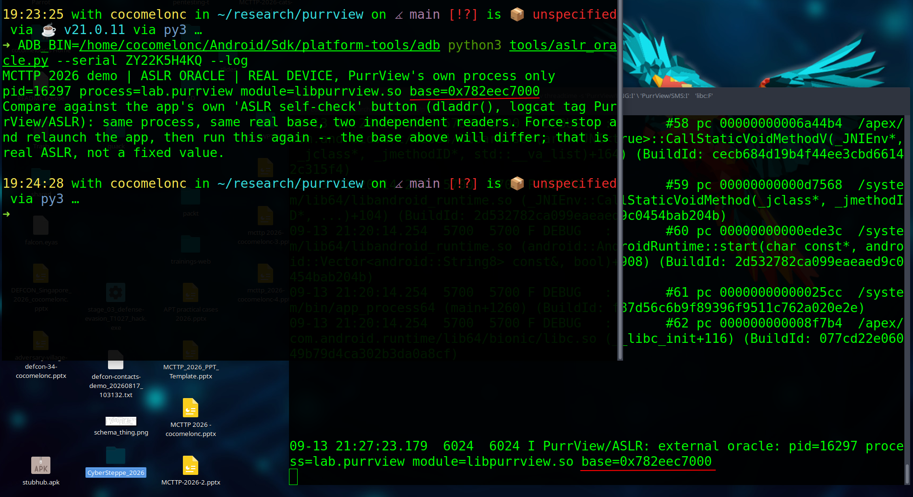    

Tap **ASLR self-check** and compare its `base=` value in logcat (tag
`PurrView/ASLR`) against the oracle's `base=` - they match, because both are
reading the same real, ASLR-randomized load address, one from inside the
process (`dladdr`) and one from outside (`/proc`). Force-stop and relaunch
the app and run the oracle again: the base changes every time, which is the
point - it is real ASLR, not a fixed or synthetic value. `--log` also mirrors
the oracle's own reading into logcat under the same `PurrView/ASLR` tag, so a
single `logcat` window carries both readings for the demo. Pass `--simulate`
instead of talking to a device to fall back to the old fully offline,
clearly-labelled toy 12-bit search, for rehearsal without hardware.

`SMS PDU PoC` uses `purrview-pdu.bin`, a local six-byte PurrView envelope plus
256 bytes of deterministic message data. It is intentionally SMS-shaped data,
not a real SMS. The worker runs in `:sms_decoder`; the vulnerable path narrows
the declared length to one byte for allocation and copies the full length,
logs the OOB write, and aborts that worker. There is no `READ_SMS`,
`RECEIVE_SMS`, `SEND_SMS`, telephony API, default-reader change or access to a
system message database. This is the cleanest way to demonstrate the parser
bug without touching a user's messages.

## Reproduce on the Motorola

Run on my Parrot Security OS:     

```bash
adb devices -l
```

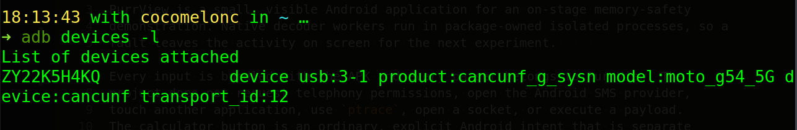     

Generate the deterministic fixtures (the command is optional because they are
already in the APK assets):

```sh
cd ~/research/purrview
python3 tools/generate_samples.py
```

Build with the project JDK and install only PurrView:

```sh
JAVA_HOME=/usr/lib/jvm/java-17-openjdk-amd64 ./gradlew --offline --no-daemon assembleDebug
ADB_BIN=/home/cocomelonc/Android/Sdk/platform-tools/adb
"$ADB_BIN" install -r app/build/outputs/apk/debug/app-debug.apk
"$ADB_BIN" shell am force-stop lab.purrview
"$ADB_BIN" shell am start -n lab.purrview/.MainActivity
```

Start the evidence stream before tapping a button:

```bash
"$ADB_BIN" logcat -c
"$ADB_BIN" logcat -v threadtime -s \
  'PurrView/PNG:I' 'PurrView/SMS:I' 'PurrView/ASLR:I' \
  'PurrView/WebP:I' 'PurrView/JPEG:I' 'libc:F' 'DEBUG:F' '*:S'
```

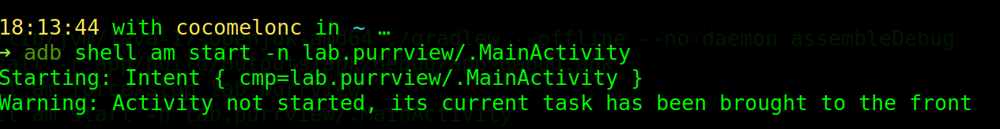     

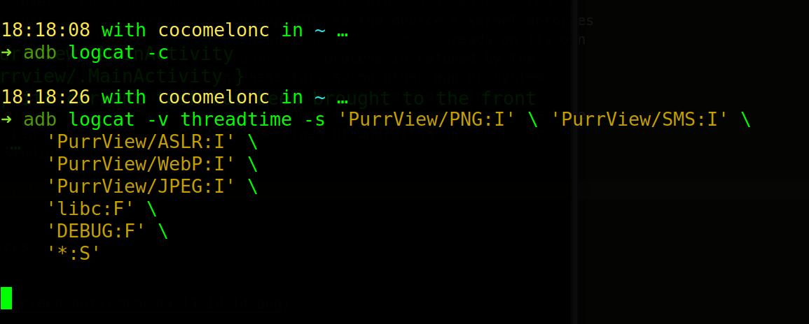          

For the strongest sequence, tap *PNG -> Run fixed*:     

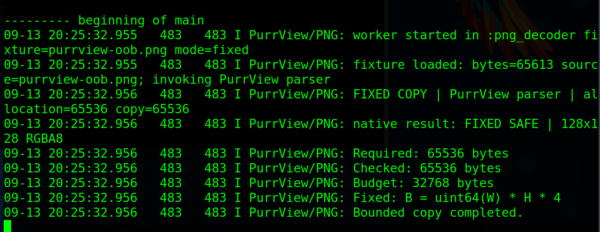    

*PNG -> Run PoC*:    

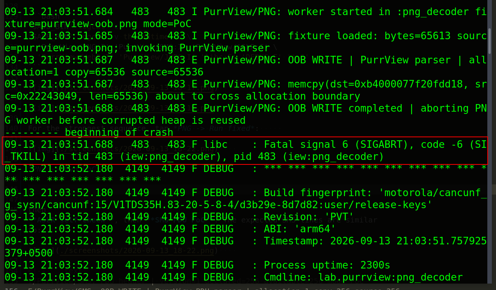     

then

*ASLR self-check*:    

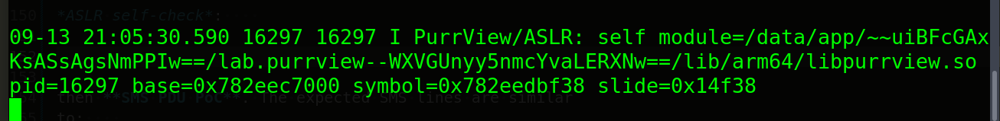     

then *SMS PDU PoC*. 
The expected SMS lines are similar to:    

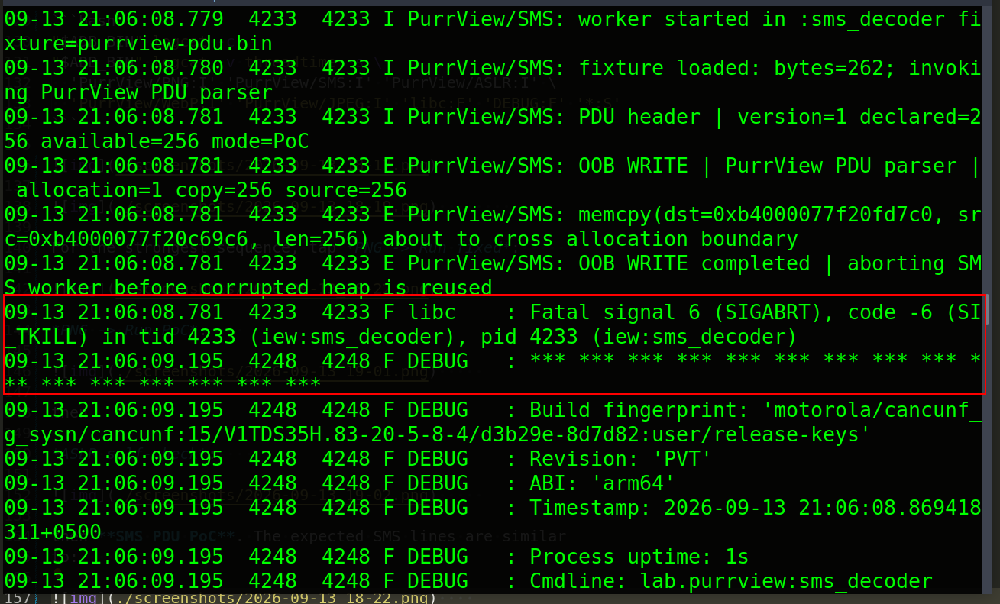    

The PNG PoC has the same shape with `allocation=1`, `copy=65536` and
`:png_decoder`. A native fault in either worker is expected for the PoC and
does not terminate the visible activity.

## server-side mutation demo

`tools/ai_mutate.py` is the missing AI layer for the talk. It is a laptop-side
controller, not an APK feature: Ollama chooses one recipe from a tiny
allow-list, the script validates it, and a deterministic builder emits an
inert PNG or PurrView-shaped PDU. The prompt and validator reject code,
shellcode, ROP, syscalls, URLs, paths and executable content. If Ollama is
unavailable, the same command uses a deterministic fallback so the stage demo
does not depend on conference Wi-Fi.

Generate a visibly different PNG and print its recipe, SHA-256 and byte diff:

```bash
cd ~/research/purrview
python3 tools/ai_mutate.py --kind png --target oob \
  --profile '{"device":"Motorola","arch":"arm64","stage":"MCTTP 2026"}' \
  --output build/ai-mutation/purrview-ai.png
```

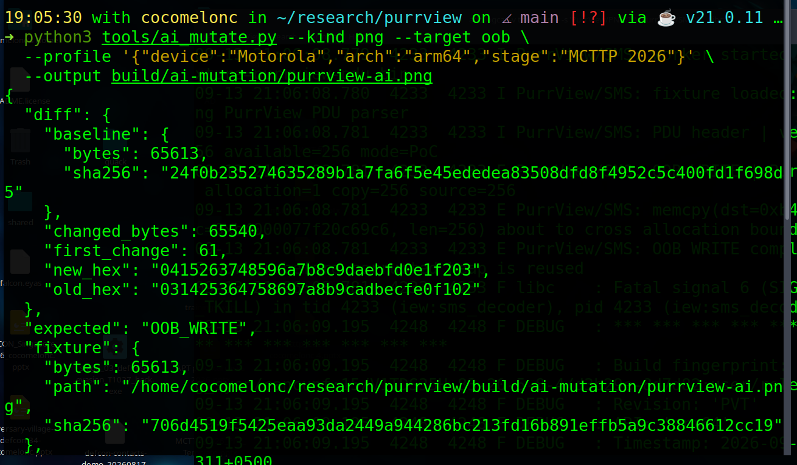    

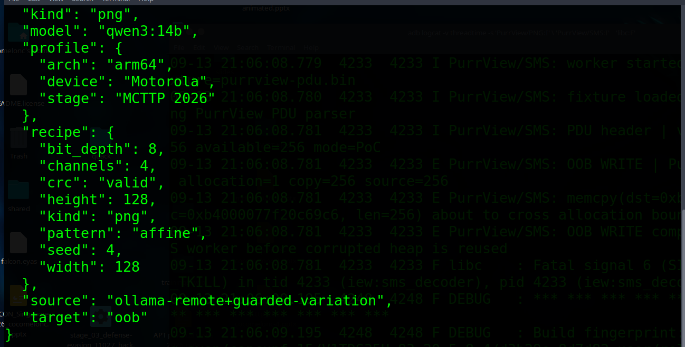    

By default the script tries three sources in order and records which one
answered in the manifest's `source` field:

1. **Remote rehearsal host** (`qwen3:14b` on `cocomelonc@10.10.10.95`, reached
   over an on-demand SSH tunnel - the host only binds Ollama to its own LAN
   address, so the tunnel forwards there rather than to `127.0.0.1`). This is
   the fastest and most reliable path when that host is reachable.
2. **Local Ollama** (`qwen3:1.7b`, CPU-only) if the remote host is unreachable
   or the SSH tunnel fails. This laptop has no GPU, so keep the local model
   small; CPU inference is also noticeably slower under memory pressure.
3. **Deterministic fallback** if both Ollama attempts fail or return a
   recipe outside the allow-list.

A cold model load can take up to a minute on either host, which is why
`--timeout` defaults to 60s. Useful overrides:

```bash
# skip the remote host entirely (e.g. off that network) and go straight to local:
python3 tools/ai_mutate.py --kind png --target oob --no-remote

# point at a different rehearsal host or model:
python3 tools/ai_mutate.py --kind png --target oob \
  --remote-ssh user@10.0.0.5 --remote-model qwen3-coder:30b
```

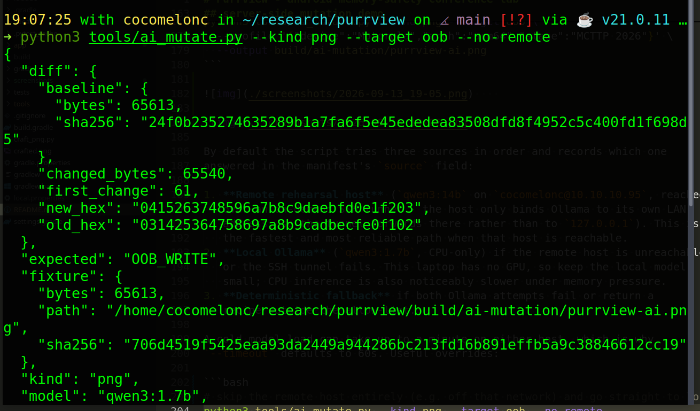     

Add `--offline` to skip Ollama entirely - this is what stage runs should use,
since it is not required and adds cold-start latency. The optional PDU
variant is:

```bash
python3 tools/ai_mutate.py --offline --kind pdu --target oob \
  --output build/ai-mutation/purrview-ai.bin
```

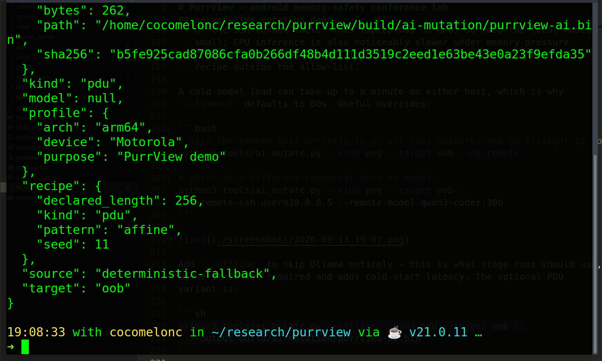     

With a USB-authorised debug phone, copy the generated PNG into PurrView's
private directory (the script never writes another app's files):

```sh
ADB_BIN=/home/cocomelonc/Android/Sdk/platform-tools/adb python3 tools/ai_mutate.py --offline --kind png --target oob --output build/ai-mutation/purrview-ai.png --adb-push --serial ZY22K5H4KQ
```

(Deliberately one line: a trailing `\` line-continuation can get eaten by
some terminals/paste handling, leaving `ADB_BIN=...` and the next line to run
as two separate commands - which fails with something like `adb: unknown
command python3`. If that happens, retype it as a single line.)

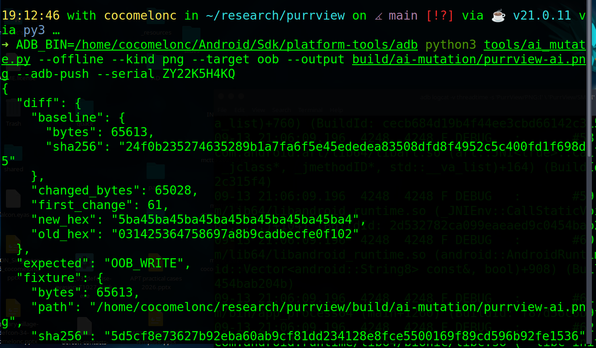    

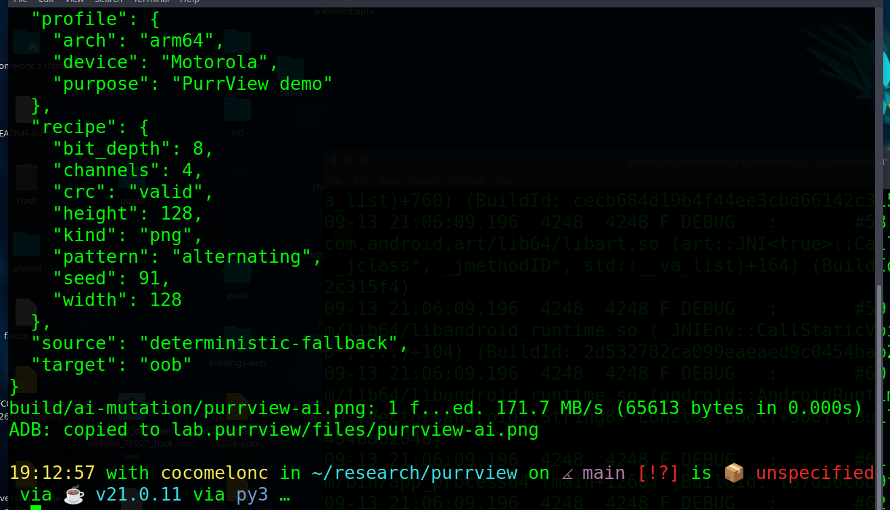    

Then press *PNG -> Run AI PoC*. The worker accepts only the fixed filename
`files/purrview-ai.png`, logs the new input and follows the same isolated
`:png_decoder` path. The presentation flow is therefore:    

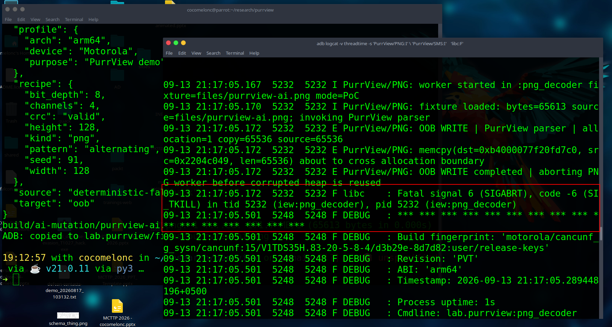    

The model selects a parser-test recipe; it does not generate an exploit or
execute anything. `build/ai-mutation/purrview-ai.png.json` is a machine-readable
record suitable for putting beside the slide or using as a fallback manifest.

### live sweep: AI searching against the real device

`--sweep N` turns the single fixture above into a repeated, on-device search:
Ollama proposes N recipes in a row (varying seed/temperature and told which
recipes it already tried, so it does not just repeat itself), and each one is
actually pushed, triggered and classified against the phone - not simulated,
not scored in a host harness. This is the strongest available demonstration
of an AI-driven search hitting a real crash on real hardware: no target is
forced, so `--sweep-target any` (the default) lets Ollama land on either a
safely-handled recipe or the parser's integer-narrowing bypass, and the
outcome is read back live from the device's own logcat, not predicted ahead
of time.

```bash
python3 tools/ai_mutate.py --sweep 8 --no-remote \
  --profile '{"device":"Motorola","arch":"arm64","stage":"MCTTP 2026"}' \
  --serial ZY22K5H4KQ
```

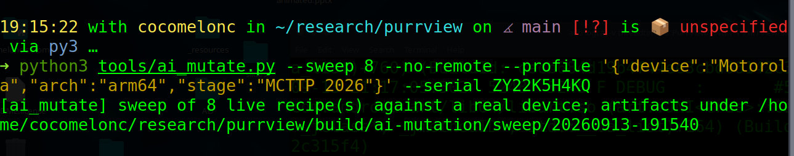     

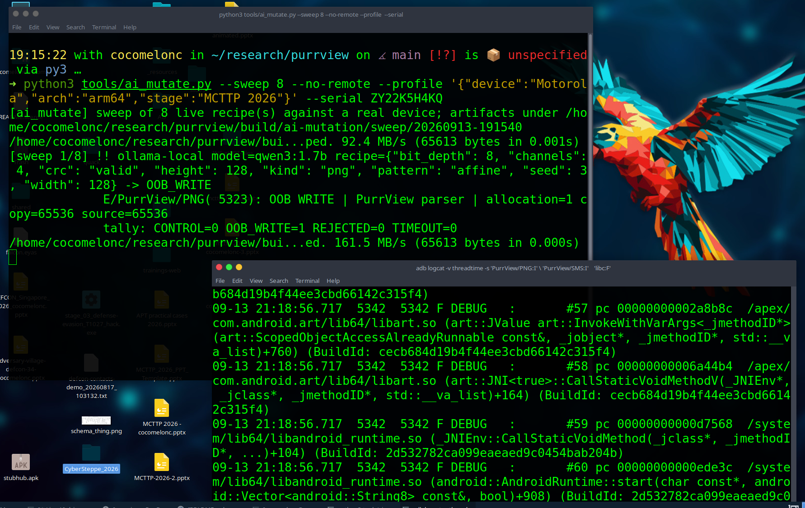     

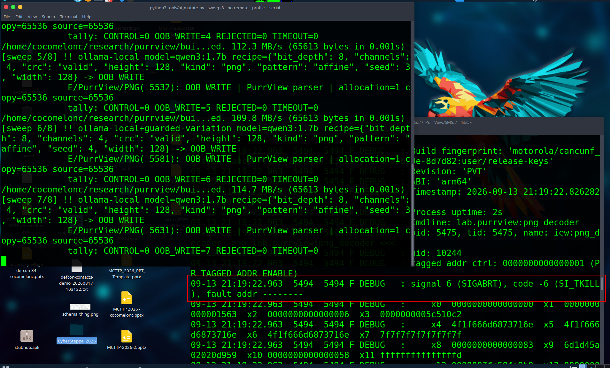     

`--no-remote` is the recommended default for the actual stage run: the
remote rehearsal host (`qwen3:14b` over SSH) is fine to rehearse against on a
known network, but on conference Wi-Fi it is one more thing that can stall -
and unlike the single fixture flow, a sweep pays that stall N times in a
row, once per iteration. `qwen3:1.7b` running locally is slower per call
(roughly 20-30s, since it "thinks" through the JSON before answering) but
consistent, which matters more than raw speed for a live sweep. Drop
`--no-remote` only when rehearsing on the same network as the remote host.

Each iteration prints its recipe, the classified outcome and a running
tally, e.g.:

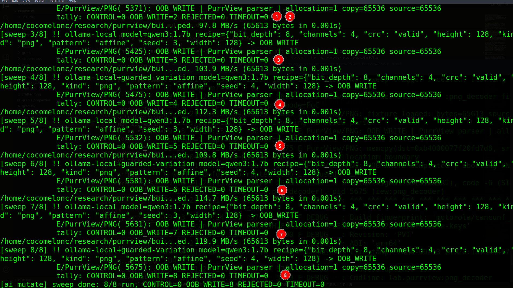     

Bring `lab.purrview/.MainActivity` to the foreground first (`am start -n
lab.purrview/.MainActivity`) - the trigger relies on the app already being
visible, exactly like tapping a button does. Every artifact from the run
(each pushed PNG, its per-iteration manifest and a `summary.json`) lands
under a timestamped `build/ai-mutation/sweep/<run>/` directory, so a sweep
can be replayed on a slide afterwards even without the phone on stage.
`--sweep-delay` (default 1.5s) paces iterations for a live audience;
`--sweep-timeout` (default 4s) is how long one iteration waits for logcat
before it is counted as `TIMEOUT`; `--offline` skips Ollama and cycles a
deterministic recipe instead, for a rehearsal without conference Wi-Fi.

The trigger itself is `AiSweepReceiver`, a minimal exported broadcast
receiver added specifically for this harness
(`app/src/main/java/lab/purrview/AiSweepReceiver.java`). It reads nothing
from the incoming broadcast - it always starts `PngDecodeService` against
PurrView's own already-private `files/purrview-ai.png`, the same fixed path
the "Run AI PoC" button already used - and it no-ops unless the installed
build is itself debuggable, so it does not widen the app's exposure beyond
the same debug-device trust level the rest of this lab already assumes.
Every other decoder service stays `exported="false"`; this is the one
deliberate, bounded exception, made so the sweep can drive the phone from
adb without a human tapping a button between recipes.

Check worker isolation without root:

```sh
"$ADB_BIN" shell ps -A | grep 'lab.purrview'
```

Remove the app normally with `"$ADB_BIN" uninstall lab.purrview`.

## host-side sanitizer evidence

The host harnesses keep sanitizer traces readable and do not contact the
network:

```bash
./tools/build_webp_fuzzer.sh app/src/main/assets/bad.webp
```

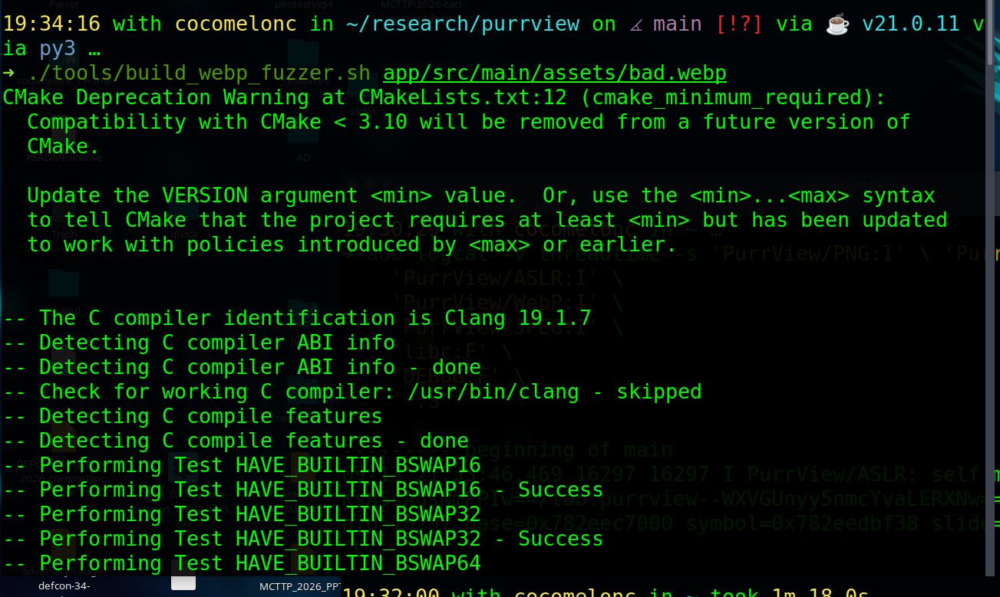     

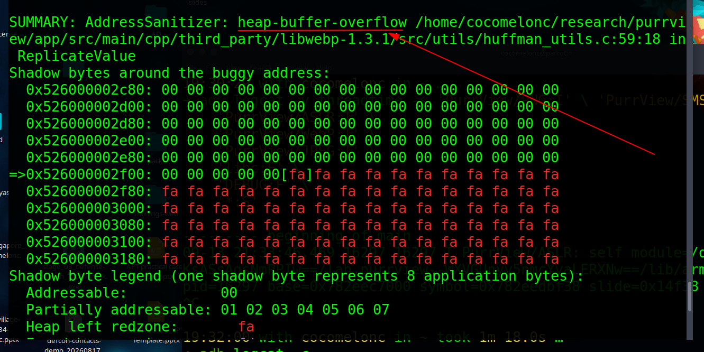     

```bash
./tools/build_jpeg_fuzzer.sh app/src/main/assets/poc.pgm
```

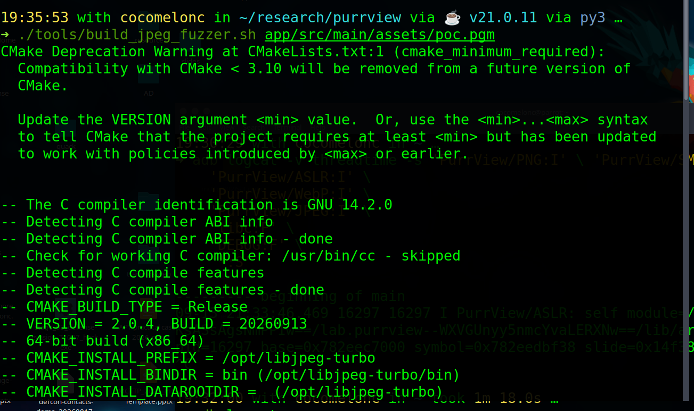    

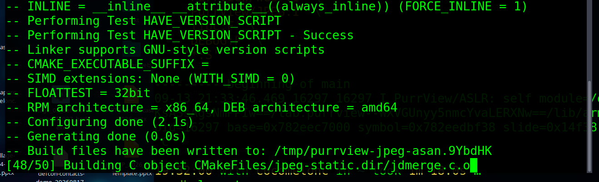    

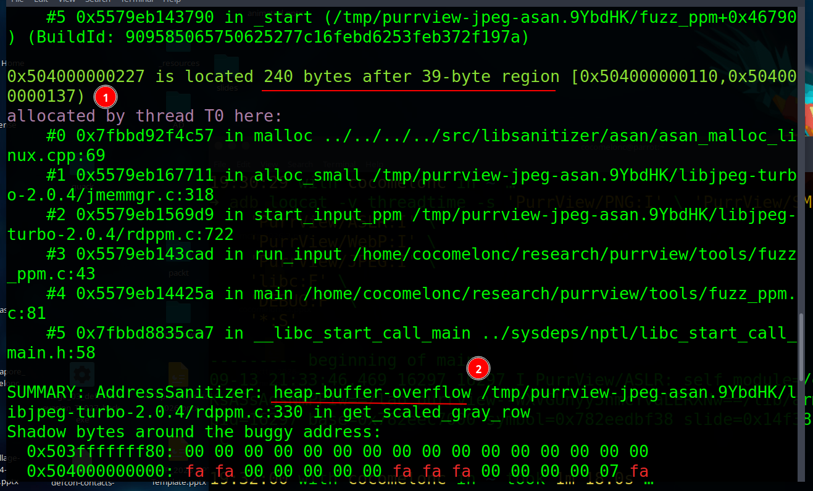     

The WebP run uses the vendored 1.3.1 tree and reports the historical
heap-buffer-overflow in `ReplicateValue`; the JPEG run exercises the 2.0.4
PGM path. A patched source tree can be used as the differential comparison.

### AI-assisted harness generation (local Ollama)

The webp/jpeg harnesses above target vendored third-party decoders.
`tools/fuzz_purrview_png.c` targets PurrView's own PNG envelope parser
(`app/src/main/cpp/parser.c`) and was drafted the same way any new harness
for this repo should be: ask a local Ollama model for a first pass, then
review and fix it by hand before it ever touches a compiler. The model is a
drafting aid, not a trusted source - it never runs unreviewed code, and the
harness only calls a decoder entry point, never shell, network or exec.

```sh
ollama run qwen3:1.7b <<'PROMPT'
Draft a libFuzzer harness (LLVMFuzzerTestOneInput) in C for this function:

  int inspect_png(const uint8_t *data, size_t size, int fixed,
                   char *out, size_t capacity);

It is declared in parser.h. Call it with fixed=0. Reject NULL data and
sizes outside 8..1048576 before calling. No file I/O, no network, no other
libraries beyond <stddef.h> and <stdint.h>.
PROMPT
```

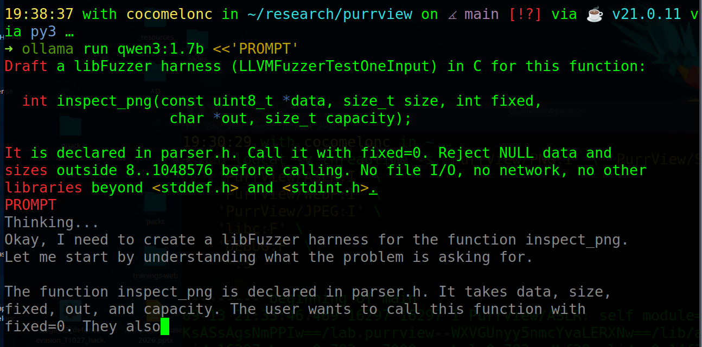     

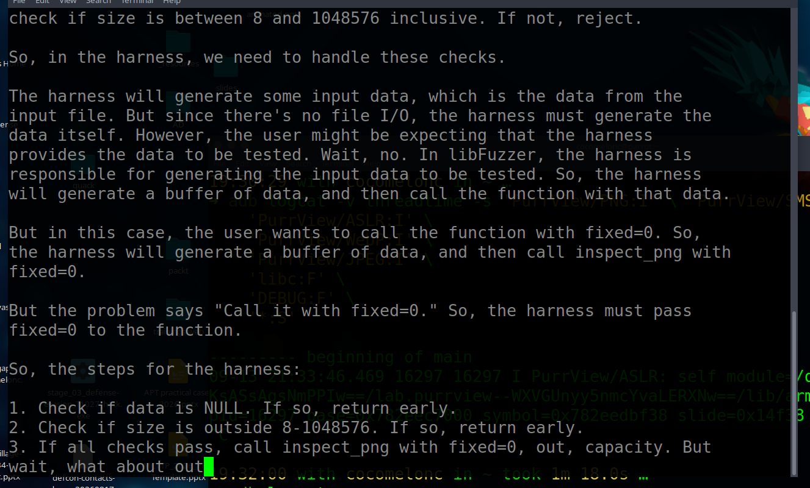     

The draft needs the same review any generated code gets here: confirm the
signature and header match `parser.h` exactly, confirm no capability the
prompt didn't ask for slipped in (file I/O, `system()`, network), and confirm
the size bounds match what the parser itself expects. The reviewed harness
is checked in; build and run it exactly like the vendored ones:

```sh
./tools/build_purrview_png_fuzzer.sh app/src/main/assets/purrview-oob.png
```

That single-fixture run reports the same heap-buffer-overflow the Android
`:png_decoder` worker hits, straight from AddressSanitizer. Drop the fixture
argument to run a short standalone campaign instead (`libFuzzer` mutates its
own corpus and writes any crash it finds to `./crash-*`):

```sh
MAX_TOTAL_TIME=30 ./tools/build_purrview_png_fuzzer.sh
```

A minute of local mutation from the one-fixture seed corpus is enough to
rediscover the same overflow without being told where it is.

## Build and tests

The checkout uses Android Gradle Plugin/Gradle 8.10, JDK 17, NDK
27.3.13750724 and CMake 3.22.1. No GPU or network download is required.

```sh
JAVA_HOME=/usr/lib/jvm/java-17-openjdk-amd64 ./gradlew --offline --no-daemon assembleDebug
python3 -m unittest discover -s tests -v
```

The parser unit tests compile the PNG envelope parser on the host. Android
logging has a stderr fallback so those tests remain portable.

## Source map

- `app/src/main/java/lab/purrview/MainActivity.java` - centered cat UI and worker controls.
- `app/src/main/java/lab/purrview/PngDecodeService.java` - isolated PNG worker.
- `app/src/main/java/lab/purrview/SmsDecodeService.java` - isolated local PDU worker.
- `app/src/main/java/lab/purrview/WebpDecodeService.java` - libwebp worker.
- `app/src/main/java/lab/purrview/JpegDecodeService.java` - libjpeg-turbo worker.
- `app/src/main/cpp/parser.c` - PNG envelope checks and PurrView OOB/fixed paths.
- `app/src/main/cpp/sms_parser.c` - local PDU parser and OOB/fixed paths.
- `app/src/main/cpp/bridge.c` - self-ASLR `dladdr` JNI bridge.
- `app/src/main/cpp/png_jni.c`, `sms_jni.c` - bounded JNI entry points.
- `app/src/main/cpp/jpeg_bridge.c`, `webp_bridge.c` - native codec bridges.
- `tools/generate_samples.py` - deterministic `purrview-oob.png` and `purrview-pdu.bin` generation.
- `tools/ai_mutate.py` - bounded Ollama/fallback recipe selection, deterministic fixture builder, diff manifest and optional `adb push`; `--sweep N` drives N live recipes against a real device via `AiSweepReceiver` and classifies each from logcat.
- `app/src/main/java/lab/purrview/AiSweepReceiver.java` - the one deliberate, bounded exported component, added so `--sweep` can trigger `PngDecodeService` from adb with no human tapping a button between recipes.
- `tools/fuzz_purrview_png.c`, `build_purrview_png_fuzzer.sh` - libFuzzer/ASan harness for `parser.c`'s `inspect_png`, drafted with local Ollama and reviewed by hand.
- `tools/aslr_oracle.py` - external `/proc`-based reader of PurrView's own real, running-process ASLR base (via `adb ... run-as`), cross-checked against the on-device self-check; `--simulate` keeps the old offline toy search for rehearsal without hardware.

The reference projects and private telemetry remain outside this checkout.
