# PurrView - android memory-safety conference lab

PurrView is a small, visible Android application for an on-stage memory-safety
demonstration. Native decoder workers run in package-owned isolated processes, so a
fault leaves the activity on screen for the next experiment.     

Every input is bundled with the APK and every parser belongs to PurrView. The
project does not request telephony permissions, open the Android SMS provider,
touch another application, use `ptrace`, open a socket, or execute a payload.
The calculator button is an ordinary, explicit Android intent that is separate
from all native parser control flow.     

## what the demos prove

### PNG parser (on-device, deterministic)

`purrview-oob.png` is a valid PNG envelope containing an inert `pCAT` ancillary
chunk. Its IHDR describes `128 × 128` RGBA8 pixels, so the required copy is
`65,536` bytes. The intentionally vulnerable PurrView policy narrows that value
to 16 bits, obtains an allocation of one byte, and calls `memcpy` with the
full 65,536-byte length. It logs the destination, source and length and then
raises `SIGABRT` before the corrupted heap can be reused. This gives a real,
repeatable OOB write in PurrView's `:png_decoder` process, while the main UI
remains alive.

`Run fixed` allocates and copies the same 65,536 bytes with a 64-bit checked
size and returns `FIXED SAFE`. `Run PoC` takes the vulnerable path. The parser
is deliberately limited to this fixture; it is not Android's system PNG
decoder.

### PNG parser: OOB read leak (bounded info-leak primitive)

The same `BUDGET BYPASS` path now also demonstrates a second, independent
primitive next to the OOB write above: an out-of-bounds *read*. PurrView's
own harness places a fixed secret, `"meow-meow MCTTP 2026"`, immediately
after the intentionally-narrow allocation, inside the same single heap
block. That is PurrView's own construction, not heap grooming, so the leak
is 100% reproducible on stage regardless of how Android's Scudo allocator
lays out unrelated chunks. Before the pre-existing OOB write and `SIGABRT`,
the parser reads back past the boundary it validated (`allocation`) and logs
whatever it finds there.

This is the "what happens after the crash" half of the talk: the same
missing bounds check that lets the parser write out-of-bounds just as
easily lets it read out-of-bounds and disclose whatever PurrView placed
next to the buffer. It stays fully bounded and local - no heap grooming, no
cross-chunk reuse, no shellcode/ROP - the class of primitive appropriate for
an on-stage demo, and the natural next step after the ASLR self-check /
`aslr_oracle.py` pairing below: a bug that discloses a known value is the
first building block toward a bug defeating ASLR by itself, instead of an
external oracle confirming the address from outside.

It triggers on the exact same button as the OOB write above - `PNG -> Run
PoC` on `purrview-oob.png` (or `Run AI PoC` / `--sweep` on the AI-mutated
fixture, since the leak lives in the shared `BUDGET BYPASS` path, not in
either specific fixture). Watch `PurrView/PNG:E` in logcat for the new line
appearing just before the existing OOB write lines:

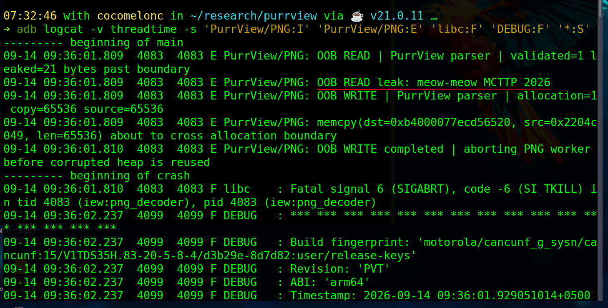     

The main UI stays alive throughout, exactly like the existing OOB write demo
- the status card still reads the worker's last published state from before
the isolated `:png_decoder` process aborted:

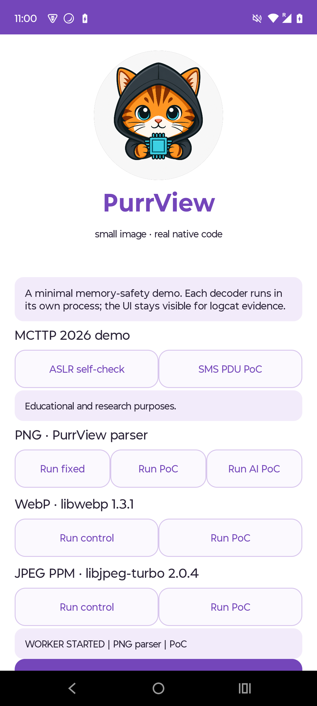

### read/write primitive: memory and file

The OOB-read leak above discloses one fixed secret at one fixed offset.
`parser.c`'s `inspect_png_rw` (and its file-backed twin,
`inspect_png_rw_file`) turn that into a genuine, controlled **read/write
primitive**: the offset, length and value are no longer fixed - they come
from the same `pCAT` chunk that already carried attacker-controlled bytes
for the OOB write, now read as a 5-byte request
(`read_offset`/`read_len`/`write_offset`/`write_len`/`write_byte`) into a
small, fixed 64-byte "companion" buffer PurrView allocates right next to a
tiny 16-byte declared allocation - the same single-malloc-block trick as
the leak, so this stays PurrView's own construction, not heap grooming or
cross-chunk corruption. Unlike the OOB write demo, this path never raises
`SIGABRT`: the point is a primitive that is actually usable, not a one-shot
crash. Two backends share the exact same request format and the exact same
recipe:

- **memory** (`inspect_png_rw`) - the companion buffer is fresh heap memory,
  gone the moment the worker process exits.
- **file** (`inspect_png_rw_file`) - the companion buffer is a file inside
  PurrView's own already-private `files/` directory, so the write survives
  past the worker process - the same bug chain reaching persistent storage.

`tools/ai_mutate.py --target rw` (PNG-only) builds the fixture: bounded
`rw_read_offset`/`rw_read_len`/`rw_write_offset`/`rw_write_len`/`rw_write_byte`
fields, each `0..255`, each window bounded to the 64-byte companion buffer,
chosen by Ollama (or the deterministic fallback with `--offline`) exactly
like every other recipe in this lab.

Step by step, memory primitive:

```bash
cd ~/research/purrview
python3 tools/ai_mutate.py --offline --kind png --target rw --adb-push --serial ZY22K5H4KQ
adb shell am start -n lab.purrview/.MainActivity
adb logcat -c
```

Tap **R/W PoC (memory)** on screen, then read the result back:

```bash
adb logcat -d -v brief -s "PurrView/PNG:I" "PurrView/PNG:E" "*:S"
```

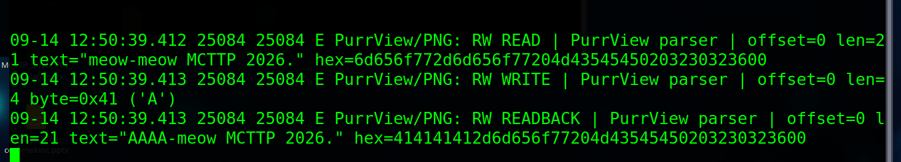        

Decoding the hex: the first read is `meow-meow MCTTP 2026\0` - the same
secret as the leak demo, but now reached through an attacker-chosen offset
instead of a fixed one. The write places `AAAA` (`0x41` x4) at offset 0, and
the read-back proves it landed exactly there: `AAAA-meow MCTTP 2026\0`.

Step by step, file primitive - same fixture, same recipe, the other button:

```bash
adb logcat -c
```

Tap **R/W PoC (file)** on screen:

```bash
adb logcat -d -v brief -s "PurrView/PNG:I" "PurrView/PNG:E" "*:S"
```

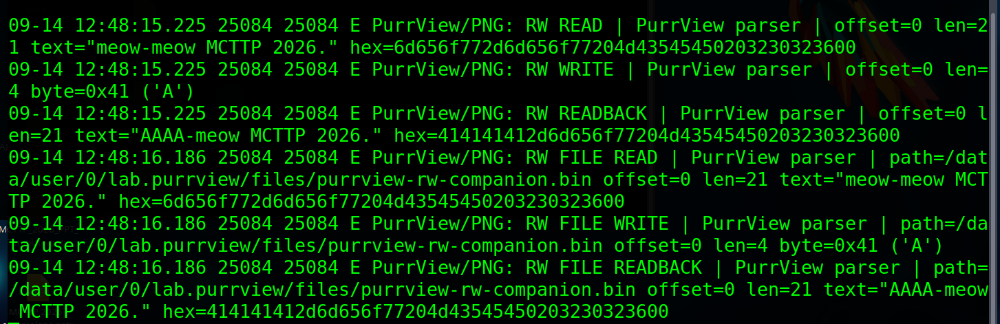     

Identical read/write/read-back to the memory version - the difference is
that this write outlives the worker process. Prove it from outside the
parser entirely, with the same confined `run-as` shell from the full-chain
section above, reading the file no logcat line is required for:

```bash
adb shell 'run-as lab.purrview sh -c "ls -la files/; xxd files/purrview-rw-companion.bin 2>/dev/null || od -An -tx1 files/purrview-rw-companion.bin"'
```

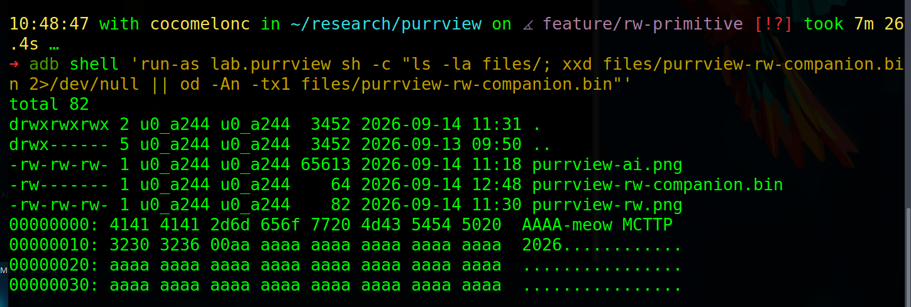     

The `AAAA` the write placed is sitting on disk, in PurrView's own sandbox,
padded with the deterministic `0xAA` filler that marks "never written by
this demo" - proof the write is real and persistent, not just a log line.

### WebP control and historical fixture

The APK vendors libwebp 1.3.1 and calls its real `WebPGetFeatures` and
`WebPDecodeRGBAInto` entry points in `:webp_decoder`. `bad.webp` is the
236-byte VP8L sample from the local fuzzing lab (SHA-256
`34f3ca760640a63c321d98267a029e8c918f434ca9a30dbf6fe1adab65d63a63`). On an
ARM release build the decoder may reject it cleanly; that is a valid device
outcome. The primary memory-safety evidence is the host ASan run, which
reaches `src/utils/huffman_utils.c:59` in libwebp 1.3.1. The APK never claims
that a clean Android return is code execution.

### JPEG/PGM control and historical fixture

The JPEG worker vendors libjpeg-turbo 2.0.4 and follows its PPM/PGM reader
path, not Android's image service. `poc.pgm` is the ten-byte `P5` fixture with
`maxval=1` and sample `0xff`, the historical CVE-2020-13790 candidate. The
worker emits a bounded preflight record and then runs the real reader in
`:jpeg_decoder`. A device may return normally or fault depending on allocator
layout; the host ASan harness is the reproducible proof.

### MCTTP 2026: self-ASLR and SMS-shaped PDU

`ASLR self-check` calls `dladdr` on a function inside PurrView's own
`libpurrview.so` and displays the actual process ID, module path, load base,
symbol address and slide. The base is checked for page alignment. It is a
self-observation of PurrView, not an address oracle against Android or another
process; no synthetic address is shown.

`tools/aslr_oracle.py` is a second, independent way to recover that same real
address: it reads `/proc/<pid>/maps` for PurrView's own running process from
the host, over `adb shell run-as lab.purrview cat /proc/<pid>/maps`. `run-as`
executes that `cat` as PurrView's own app UID, so the device's kernel enforces
the same-UID-or-`CAP_SYS_PTRACE` rule for `/proc/<pid>/maps` reads on its own
- a PID that is not actually a `lab.purrview` process is refused by the
kernel regardless of what the script asks for, so no other app or system
process is ever a valid target. It reads mapping metadata only (never
`/proc/<pid>/mem`, no ptrace-attach), and only ever prints one library's base
address, pid and process name - the same class of operation as `pmap` or
Android Studio's profiler.

Run it against the live device and it will find exactly the same base the
self-check button reports:     

```bash
"$ADB_BIN" shell am start -n lab.purrview/.MainActivity
ADB_BIN="$ADB_BIN" python3 tools/aslr_oracle.py --serial ZY22K5H4KQ --log
```

    

Tap **ASLR self-check** and compare its `base=` value in logcat (tag
`PurrView/ASLR`) against the oracle's `base=` - they match, because both are
reading the same real, ASLR-randomized load address, one from inside the
process (`dladdr`) and one from outside (`/proc`). Force-stop and relaunch
the app and run the oracle again: the base changes every time, which is the
point - it is real ASLR, not a fixed or synthetic value. `--log` also mirrors
the oracle's own reading into logcat under the same `PurrView/ASLR` tag, so a
single `logcat` window carries both readings for the demo. Pass `--simulate`
instead of talking to a device to fall back to the old fully offline,
clearly-labelled toy 12-bit search, for rehearsal without hardware.

`SMS PDU PoC` uses `purrview-pdu.bin`, a local six-byte PurrView envelope plus
256 bytes of deterministic message data. It is intentionally SMS-shaped data,
not a real SMS. The worker runs in `:sms_decoder`; the vulnerable path narrows
the declared length to one byte for allocation and copies the full length,
logs the OOB write, and aborts that worker. There is no `READ_SMS`,
`RECEIVE_SMS`, `SEND_SMS`, telephony API, default-reader change or access to a
system message database. This is the cleanest way to demonstrate the parser
bug without touching a user's messages.

## Reproduce on the Motorola

Run on my Parrot Security OS:     

```bash
adb devices -l
```

     

Generate the deterministic fixtures (the command is optional because they are
already in the APK assets):

```sh
cd ~/research/purrview
python3 tools/generate_samples.py
```

Build with the project JDK and install only PurrView:

```sh
JAVA_HOME=/usr/lib/jvm/java-17-openjdk-amd64 ./gradlew --offline --no-daemon assembleDebug
ADB_BIN=/home/cocomelonc/Android/Sdk/platform-tools/adb
"$ADB_BIN" install -r app/build/outputs/apk/debug/app-debug.apk
"$ADB_BIN" shell am force-stop lab.purrview
"$ADB_BIN" shell am start -n lab.purrview/.MainActivity
```

Start the evidence stream before tapping a button:

```bash
"$ADB_BIN" logcat -c
"$ADB_BIN" logcat -v threadtime -s \
  'PurrView/PNG:I' 'PurrView/SMS:I' 'PurrView/ASLR:I' \
  'PurrView/WebP:I' 'PurrView/JPEG:I' 'libc:F' 'DEBUG:F' '*:S'
```

     

          

For the strongest sequence, tap *PNG -> Run fixed*:     

    

*PNG -> Run PoC*:    

     

then

*ASLR self-check*:    

     

then *SMS PDU PoC*. 
The expected SMS lines are similar to:    

    

The PNG PoC has the same shape with `allocation=1`, `copy=65536` and
`:png_decoder`. A native fault in either worker is expected for the PoC and
does not terminate the visible activity.

## server-side mutation demo

`tools/ai_mutate.py` is the missing AI layer for the talk. It is a laptop-side
controller, not an APK feature: Ollama chooses one recipe from a tiny
allow-list, the script validates it, and a deterministic builder emits an
inert PNG or PurrView-shaped PDU. The prompt and validator reject code,
shellcode, ROP, syscalls, URLs, paths and executable content. If Ollama is
unavailable, the same command uses a deterministic fallback so the stage demo
does not depend on conference Wi-Fi.

Generate a visibly different PNG and print its recipe, SHA-256 and byte diff:

```bash
cd ~/research/purrview
python3 tools/ai_mutate.py --kind png --target oob \
  --profile '{"device":"Motorola","arch":"arm64","stage":"MCTTP 2026"}' \
  --output build/ai-mutation/purrview-ai.png
```

    

    

By default the script tries three sources in order and records which one
answered in the manifest's `source` field:

**Remote rehearsal host** (`qwen3:14b` on `cocomelonc@10.10.10.95`, reached
   over an on-demand SSH tunnel - the host only binds Ollama to its own LAN
   address, so the tunnel forwards there rather than to `127.0.0.1`). This is
   the fastest and most reliable path when that host is reachable.      

**Local Ollama** (`qwen3:1.7b`, CPU-only) if the remote host is unreachable
   or the SSH tunnel fails. This laptop has no GPU, so keep the local model
   small; CPU inference is also noticeably slower under memory pressure.       

**Deterministic fallback** if both Ollama attempts fail or return a
   recipe outside the allow-list.

A cold model load can take up to a minute on either host, which is why
`--timeout` defaults to 60s. Useful overrides:

```bash
# skip the remote host entirely (e.g. off that network) and go straight to local:
python3 tools/ai_mutate.py --kind png --target oob --no-remote

# point at a different rehearsal host or model:
python3 tools/ai_mutate.py --kind png --target oob \
  --remote-ssh user@10.0.0.5 --remote-model qwen3-coder:30b
```

     

Add `--offline` to skip Ollama entirely - this is what stage runs should use,
since it is not required and adds cold-start latency. The optional PDU
variant is:

```bash
python3 tools/ai_mutate.py --offline --kind pdu --target oob \
  --output build/ai-mutation/purrview-ai.bin
```

     

With a USB-authorised debug phone, copy the generated PNG into PurrView's
private directory (the script never writes another app's files):

```sh
ADB_BIN=/home/cocomelonc/Android/Sdk/platform-tools/adb python3 tools/ai_mutate.py --offline --kind png --target oob --output build/ai-mutation/purrview-ai.png --adb-push --serial ZY22K5H4KQ
```

(Deliberately one line: a trailing `\` line-continuation can get eaten by
some terminals/paste handling, leaving `ADB_BIN=...` and the next line to run
as two separate commands - which fails with something like `adb: unknown
command python3`. If that happens, retype it as a single line.)

    

    

Then press *PNG -> Run AI PoC*. The worker accepts only the fixed filename
`files/purrview-ai.png`, logs the new input and follows the same isolated
`:png_decoder` path. The presentation flow is therefore:    

    

The model selects a parser-test recipe; it does not generate an exploit or
execute anything. `build/ai-mutation/purrview-ai.png.json` is a machine-readable
record suitable for putting beside the slide or using as a fallback manifest.

### live sweep: AI searching against the real device

`--sweep N` turns the single fixture above into a repeated, on-device search:
Ollama proposes N recipes in a row (varying seed/temperature and told which
recipes it already tried, so it does not just repeat itself), and each one is
actually pushed, triggered and classified against the phone - not simulated,
not scored in a host harness. This is the strongest available demonstration
of an AI-driven search hitting a real crash on real hardware: no target is
forced, so `--sweep-target any` (the default) lets Ollama land on either a
safely-handled recipe or the parser's integer-narrowing bypass, and the
outcome is read back live from the device's own logcat, not predicted ahead
of time.

```bash
python3 tools/ai_mutate.py --sweep 8 --no-remote \
  --profile '{"device":"Motorola","arch":"arm64","stage":"MCTTP 2026"}' \
  --serial ZY22K5H4KQ
```

     

     

     

`--no-remote` is the recommended default for the actual stage run: the
remote rehearsal host (`qwen3:14b` over SSH) is fine to rehearse against on a
known network, but on conference Wi-Fi it is one more thing that can stall -
and unlike the single fixture flow, a sweep pays that stall N times in a
row, once per iteration. `qwen3:1.7b` running locally is slower per call
(roughly 20-30s, since it "thinks" through the JSON before answering) but
consistent, which matters more than raw speed for a live sweep. Drop
`--no-remote` only when rehearsing on the same network as the remote host.

Each iteration prints its recipe, the classified outcome and a running
tally, e.g.:

     

Bring `lab.purrview/.MainActivity` to the foreground first (`am start -n
lab.purrview/.MainActivity`) - the trigger relies on the app already being
visible, exactly like tapping a button does. Every artifact from the run
(each pushed PNG, its per-iteration manifest and a `summary.json`) lands
under a timestamped `build/ai-mutation/sweep/<run>/` directory, so a sweep
can be replayed on a slide afterwards even without the phone on stage.
`--sweep-delay` (default 1.5s) paces iterations for a live audience;
`--sweep-timeout` (default 4s) is how long one iteration waits for logcat
before it is counted as `TIMEOUT`; `--offline` skips Ollama and cycles a
deterministic recipe instead, for a rehearsal without conference Wi-Fi.

The trigger itself is `AiSweepReceiver`, a minimal exported broadcast
receiver added specifically for this harness
(`app/src/main/java/lab/purrview/AiSweepReceiver.java`). It reads nothing
from the incoming broadcast - it always starts `PngDecodeService` against
PurrView's own already-private `files/purrview-ai.png`, the same fixed path
the "Run AI PoC" button already used - and it no-ops unless the installed
build is itself debuggable, so it does not widen the app's exposure beyond
the same debug-device trust level the rest of this lab already assumes.
Every other decoder service stays `exported="false"`; this is the one
deliberate, bounded exception, made so the sweep can drive the phone from
adb without a human tapping a button between recipes.

### live device recon: ReconCat

The `--profile` shown above (`{"device":"Motorola","arch":"arm64",...}`) can
be hand-typed, but it does not have to be: `recon/` is a second, standalone
app, *ReconCat* (`applicationId lab.reconcat`), whose only job is to
report the device it is installed on. It is deliberately a separate app from
PurrView rather than a feature bolted onto it - PurrView is this lab's
vulnerable target, and a demo about attacker recon should not have the
victim fingerprint itself for its own attacker's tooling.

ReconCat logs only public, permission-free `Build.*` fields - manufacturer,
model, device, brand, hardware, board, type, `Build.SUPPORTED_ABIS[0]` as
`arch`, and `Build.VERSION.SDK_INT` as `sdk`. It deliberately excludes
anything that acts as a persistent device identifier (no `Build.SERIAL`,
`ANDROID_ID`, IMEI) and anything that is build-machine metadata rather than
device identity (no `Build.HOST`/`USER`/`FINGERPRINT`/radio version).

Whenever `tools/ai_mutate.py` is already doing a live round-trip to the
phone (`--sweep`, `--density`, `--adb-push`) and `--profile` was not passed
explicitly, it triggers ReconCat itself - clears logcat, broadcasts
`lab.reconcat.action.DUMP_RECON`, and reads the resulting `RECON {...}` line
back - so the model's context is the real device in front of the audience,
not a placeholder. If ReconCat is not installed or nothing shows up in
logcat in time, it falls back to the static placeholder profile instead of
failing the run.

To install it and see this manually, without going through `ai_mutate.py`
at all:

```bash
adb install -r recon/build/outputs/apk/debug/recon-debug.apk   # once, or after a rebuild
adb shell am start -n lab.reconcat/.ReconActivity
```

Tap **Dump recon** on screen - the same JSON that would otherwise show up
silently in `[ai_mutate] profile: live recon from ReconCat (...)`:

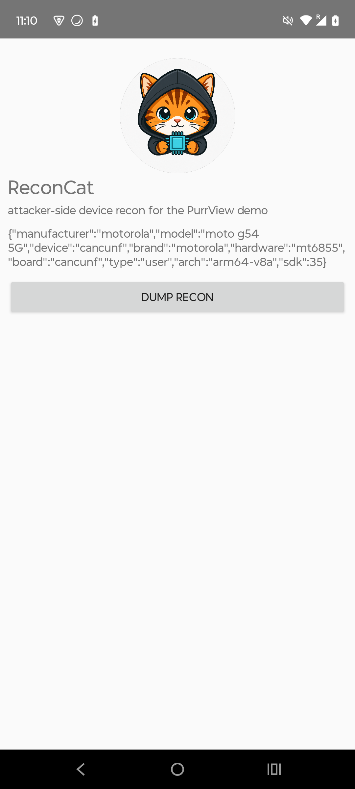

Or trigger the same broadcast headless, exactly like `ai_mutate.py` does
internally, with no app UI involved:

```bash
adb logcat -c
adb shell am broadcast -a lab.reconcat.action.DUMP_RECON -n lab.reconcat/.ReconReceiver
adb logcat -d -v brief -s ReconCat:I "*:S"
```

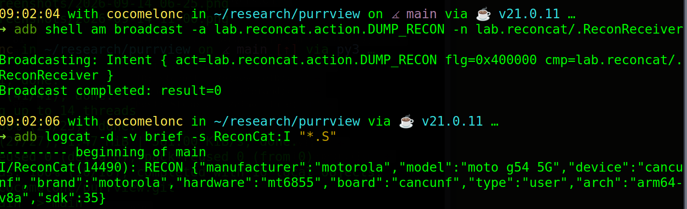

### the full chain, and where the demo stops

Everything above composes into one command:

```bash
adb shell am start -n lab.purrview/.MainActivity
python3 tools/ai_mutate.py --sweep 1 --offline --sweep-target oob --serial ZY22K5H4KQ
```

```
[ai_mutate] profile: live recon from ReconCat (ZY22K5H4KQ)
...001.png: 1 file pushed, 0 skipped.
[sweep 1/1] !! deterministic-fallback ... recipe={"height": 128, "width": 128, ...} -> OOB_WRITE
             E/PurrView/PNG(15865): OOB WRITE | PurrView parser | allocation=1 copy=65536 source=65536
             tally: CONTROL=0 OOB_WRITE=1 REJECTED=0 TIMEOUT=0
```

ReconCat is triggered first for a live `--profile`; a bounded recipe is
chosen (Ollama, or the deterministic fallback with `--offline`); the
deterministic builder emits an inert PNG; it is pushed into PurrView's own
already-private `files/purrview-ai.png` (`adb push` + `run-as ... cp` -
`push_to_device`); `AiSweepReceiver` starts the same `Run AI PoC` path;
`PngDecodeService` takes the OOB write and aborts, classified live from
logcat. Nothing here is simulated or scored in a host harness.

The closing beat: reuse the exact same `run-as` primitive that pushed the
fixture, but as a plain interactive-ish shell, scoped only to PurrView's own
app UID, to show live that the fixture which just crashed the parser landed
nowhere but PurrView's own sandbox:

```bash
adb shell 'run-as lab.purrview sh -c "pwd; ls -la files/"'
```

```
/data/user/0/lab.purrview
-rw-rw-rw- 1 u0_a244 u0_a244 65613 2026-09-14 11:18 purrview-ai.png
```

`sha256sum files/purrview-ai.png` inside that shell matches the manifest
`ai_mutate.py` wrote on the laptop, byte for byte - proof that what the
model chose is exactly what landed on the phone, not a claim taken on
faith. The same shell can write there too (it is PurrView's own `files/`
directory, after all) but cannot read anywhere else on the device, not even
ReconCat's sandbox next to it:

```bash
adb shell 'run-as lab.purrview cat /data/data/lab.reconcat/files/recon.json'   # Permission denied
adb shell 'run-as lab.purrview cat /data/system/packages.list'                 # Permission denied
```

`run-as` is not root and not a jailbreak - it is a standard adb debug-build
feature that execs a shell as the app's own UID (`u0_a244(u0_a244)` here,
never `root`), the same per-UID sandbox Android already enforces against
PurrView itself, whether the caller is JNI code or a human at a shell
prompt. There is nowhere further to go from here: the model picked a
bounded recipe, the laptop built it deterministically, it never touched
anything but PurrView's own already-private storage, and it crashed exactly
the one worker it was aimed at. That is the natural place to end the talk -
PurrView never had unconstrained code execution to begin with, and neither
does this shell.

#### From a single exact slice to a full 2-D search

`--sweep` does not hold $`W`$ fixed the way `--density` below does. PurrView's own IHDR check rejects anything that is not 8-bit-depth RGBA, so for any recipe the parser is willing to accept at all, the branch it takes is - just as in the density model - a pure function of the pair $`(W,H)`$ through the same truncation:

```math
\text{OOB\_WRITE}(W,H) \iff \big(4WH \bmod 65536\big) \le 32768 \ \wedge\ 4WH > 32768 .
```

`--density` is the $`W`$-fixed, one-dimensional slice of exactly this surface, chosen because it is small enough to enumerate by hand for a talk; `--sweep` explores the full two-dimensional $`(W,H)`$ domain a real fuzzer would actually search, with the added realism that *which* point gets tried next is chosen by a model that has never seen `parser.c`.

Treat the search as a sequence of independent proposals with some per-trial success probability $`\pi`$ (`--density`'s $`p`$ below is the exact value of $`\pi`$ once $`W`$ is fixed; the full 2-D $`\pi`$ is the same finite sum, just taken over the whole $`(W,H)`$ box instead of one row of it). The number of trials $`T`$ until the first hit is then geometric:

```math
\Pr[T = n] = (1-\pi)^{\,n-1}\pi, \qquad \mathbb{E}[T] = \frac{1}{\pi}, \qquad \mathrm{Var}(T) = \frac{1-\pi}{\pi^2}.
```

For $`W=128`$'s own $`\pi = 13/51 \approx 0.255`$ (derived below), a memoryless searcher restricted to that row would need only $`\mathbb{E}[T] \approx 3.9`$ proposals on average to land on the bypass - one reason `--sweep-target any` reliably surfaces both outcomes within a handful of iterations rather than requiring a long campaign, and a useful null model for later noticing if a given model's proposals systematically *avoid* the bypass region instead of sampling it like the geometric law predicts.

### bypass-density model: exact probability, validated live

`--density N` is a different kind of demo: instead of hunting for a crash,
it derives an exact probability for one and then checks that prediction
against N live draws on the real device.

The PurrView PNG worker's defect is a clean modular-arithmetic bug:
`checked = actual mod 65536`, where `actual = 4 * width * height`. Holding
`width` fixed, `height` walks `checked` through an arithmetic progression
with a known period, so the fraction of heights that land on the
`OOB_WRITE` branch is not an estimate - it is computed exactly by
enumerating every reachable height (the range is always small, bounded by
`MAX_FIXTURE`), with no approximation and no model output involved:

```sh
python3 tools/ai_mutate.py --density 20 --no-remote --serial ZY22K5H4KQ
```

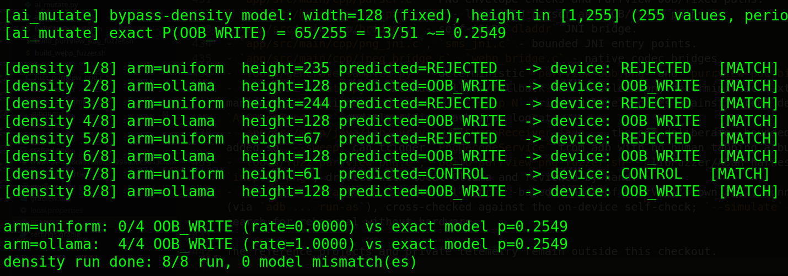     

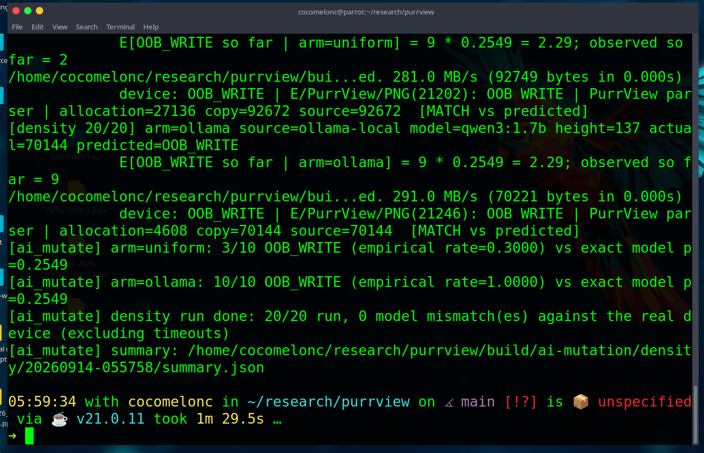    

By default `--density` alternates every iteration between two arms drawing
`height` from the same range: `uniform` (true `random.randint`, the
statistical baseline) and `ollama` (the model chooses, still bounded to the
same range). Each iteration prints the running expected count for its arm
(`E[OOB_WRITE so far] = draws * p`) *before* the device responds, then the
real outcome from logcat and whether it matched the closed-form prediction
- across every run so far every single draw has matched, because the
branch a given height takes is fully determined by the formula above, not
a coin flip; only *which heights get tried* is random. `--density-source
uniform` or `--density-source ollama` locks a run to one arm; `--density-width`
picks a different fixed width (default 128, matching the PoC's own
128x128 example).

The two arms exist to compare a model's choices against true randomness,
and the first attempt at this surfaced a real, worth-keeping finding: the
schema example in the model's prompt originally hardcoded `{"height":128}`
(the range's midpoint, which for width=128 happens to equal the width
itself) - `qwen3:1.7b` copied that literal example on every single call
regardless of temperature, picking height=128 four times in a row. The fix
was to randomize the schema's illustrative number on every call so it can
never become a repeatable anchor (`prompt_for_height()` in
`tools/ai_mutate.py`). After the fix the model's heights are genuinely
distinct call to call, though they still cluster somewhat above the width
rather than spreading uniformly across the full range - a softer, honest
sampling bias worth mentioning on stage in its own right: even a
"randomly" prompted small local model does not sample like `random.randint`
does, and that gap is now something this tool can measure, not just assert.

#### The exact model, in full

Fix the width $`W`$. Let $`M = 2^{16} = 65536`$ and $`B = 32768 = M/2`$ be PurrView's budget. For a candidate height $`h \in \mathbb{Z}_{>0}`$, `parser.c` computes

```math
a(h) = 4Wh \qquad \text{(true byte count, exact, 64-bit)}
```

```math
c(h) = a(h) \bmod M \qquad \text{(the 16-bit truncated count PurrView actually checks)}
```

and classifies the fixture as

```math
\text{OOB\_WRITE}(h) \iff c(h) \le B \ \wedge\ a(h) > B .
```

**Periodicity.** Let $`g = \gcd(4W, M)`$ and $`p = M/g`$. Since $`4W \cdot p \equiv 0 \pmod M`$ by construction, $`c(h+p) = c(h)`$ for every $`h`$: the truncated size is *exactly* periodic in $`h`$ with period $`p`$, and as $`h`$ ranges over any $`p`$ consecutive integers, $`c(h)`$ is a bijection onto the order-$`p`$ subgroup $`\{0, g, 2g, \dots, (p-1)g\} \subset \mathbb{Z}/M\mathbb{Z}`$ generated by $`4W \bmod M`$.

**PurrView's own width sits in the clean case.** Because $`M`$ is a power of two, $`g = 2^{\min(v_2(4W),\,16)}`$, where $`v_2(\cdot)`$ is the 2-adic valuation. For any width that is itself a power of two and satisfies PurrView's own IHDR bound $`W \le 16384 = 2^{14}`$ (so $`v_2(4W) = v_2(W)+2 \le 16`$), this collapses to $`g = 4W`$ exactly, hence

```math
p = \frac{M}{4W}, \qquad k := \frac{4W}{g} = 1 .
```

$`k=1`$ means $`a(h)`$ crosses a multiple of $`M`$ **exactly once per period**: one contiguous run of `OOB_WRITE` heights per cycle of $`c`$, not several interleaved runs. (A non-power-of-two width gives $`k>1`$ and $`k`$ separate bypass runs per period. PurrView's default $`W=128=2^7`$ is the clean $`k=1`$ case - exactly why the demo's own prediction is such a tidy arithmetic progression rather than a scattered set.)

**Locating the one run per period.** Let $`h_0 = \lfloor B/(4W) \rfloor`$. For $`h \le h_0`$: $`a(h) = c(h) \le B`$ trivially - `CONTROL`, no truncation has mattered yet. For $`h_0 < h < p`$: $`c(h) = a(h) > B`$ - `REJECTED` (no wrap has happened, so the check sees the real, oversized value and correctly refuses it). At $`h = p`$: $`c(p) = 0`$ while $`a(p) = M > B`$ - `OOB_WRITE`. The run continues while $`c(h) = 4W(h-p) \le B`$, i.e. through $`h = p + h_0`$, then `REJECTED` again until the next wrap at $`h = 2p`$. So, per period, the bug produces one `OOB_WRITE` run of exactly $`h_0+1`$ heights, immediately followed by a `REJECTED` run of $`p-h_0-1`$ heights.

**Closed form over the demo's finite domain.** `--density` draws $`h`$ uniformly from $`[1, h_{\max}]`$, where

```math
h_{\max}(W) = \left\lfloor \frac{F_{\max} - O(W)}{4W} \right\rfloor ,
```

$`F_{\max} = 131072`$ bytes (`MAX_FIXTURE`) and $`O(W)`$ is the constant PNG framing overhead at that width (signature plus chunk headers/CRCs; independent of height - see `density_fixture_overhead()`). Writing $`q = \lfloor h_{\max}/p \rfloor`$ and $`r = h_{\max} - qp`$, the exact count of `OOB_WRITE` heights in $`[1, h_{\max}]`$ is

```math
N(h_{\max}) =
\begin{cases}
0 & q = 0 \\[4pt]
(q-1)(h_0+1) \;+\; \min\!\big(h_0+1,\ r+1\big) & q \ge 1 ,
\end{cases}
```

and the exact probability the tool reports is simply

```math
p \;=\; \Pr[\text{OOB\_WRITE}] \;=\; \frac{N(h_{\max})}{h_{\max}} .
```

For the demo's own numbers - $`W=128`$, $`O(128)=77`$ bytes, hence $`h_{\max}=255`$, $`p_{\text{period}}=128`$, $`h_0=64`$, $`q=1`$, $`r=127`$:

```math
N(255) = 0 \cdot 65 \;+\; \min(65,\ 128) = 65
\quad\Longrightarrow\quad
p = \frac{65}{255} = \frac{13}{51} \approx 0.2549 ,
```

exactly the value `run_density()` prints, and exactly the fraction `density_exact_probability()` returns as a `Fraction(13, 51)` - not a curve fit to observations, but a count derived from `parser.c`'s own bug before a single byte is ever pushed to the phone.

**What "validated live" actually certifies.** If $`H \sim \mathrm{Uniform}\{1,\dots,h_{\max}\}`$, then $`X = \mathbf{1}[\text{OOB\_WRITE}(H)]`$ is *exactly* $`\mathrm{Bernoulli}(p)`$ - not approximately, since $`X`$ is a deterministic pushforward of a uniform random variable through a fixed, 0/1-valued map, not a physical coin flip. Over $`N`$ i.i.d. draws, $`S_N = \sum_i X_i \sim \mathrm{Binomial}(N,p)`$, so $`\mathbb{E}[S_N] = Np`$ (the running `E[OOB_WRITE so far]` line printed before each device response) and $`\mathrm{Var}(S_N) = Np(1-p)`$. But the strongest evidence this demo produces is not that $`S_N/N \to p`$ in aggregate - that would only need the weak law of large numbers - it is that **every individual draw's outcome has matched the value $`\mathbf{1}[\text{OOB\_WRITE}(H_i)]`$ computed in advance**, a per-trial certificate rather than a merely converging sample proportion.

The `uniform` arm is where that Bernoulli$`(p)`$ model is assumed by construction (`random.randint`); the `ollama` arm is deliberately the one place it is *not* assumed, since the model's heights are not drawn from $`\mathrm{Uniform}\{1,\dots,h_{\max}\}`$ (see the clustering note above) - its indicator sequence is instead $`\mathrm{Bernoulli}(q)`$ for some model-induced $`q`$ that need not equal $`p`$. Comparing the empirical $`\hat q = S_N^{\text{ollama}}/n`$ against the exact $`p`$ with a Wilson score interval,

```math
\frac{\hat q + \dfrac{z_{\alpha/2}^2}{2n} \;\pm\; z_{\alpha/2}
\sqrt{\dfrac{\hat q(1-\hat q)}{n} + \dfrac{z_{\alpha/2}^2}{4n^2}}}
{1 + \dfrac{z_{\alpha/2}^2}{n}}, \qquad n = N^{\text{ollama}},
```

is the natural next tightening of the "cluster above the width" observation already logged above - from a qualitative note into a testable claim, using Wilson rather than the plain normal (Wald) interval precisely because $`n`$ here is small and $`\hat q`$ is not guaranteed to sit near $`0.5`$.

Check worker isolation without root:

```sh
"$ADB_BIN" shell ps -A | grep 'lab.purrview'
```

Remove the app normally with `"$ADB_BIN" uninstall lab.purrview`.

## host-side sanitizer evidence

The host harnesses keep sanitizer traces readable and do not contact the
network:

```bash
./tools/build_webp_fuzzer.sh app/src/main/assets/bad.webp
```

     

     

```bash
./tools/build_jpeg_fuzzer.sh app/src/main/assets/poc.pgm
```

    

    

     

The WebP run uses the vendored 1.3.1 tree and reports the historical
heap-buffer-overflow in `ReplicateValue`; the JPEG run exercises the 2.0.4
PGM path. A patched source tree can be used as the differential comparison.

### AI-assisted harness generation (local Ollama)

The webp/jpeg harnesses above target vendored third-party decoders.
`tools/fuzz_purrview_png.c` targets PurrView's own PNG envelope parser
(`app/src/main/cpp/parser.c`) and was drafted the same way any new harness
for this repo should be: ask a local Ollama model for a first pass, then
review and fix it by hand before it ever touches a compiler. The model is a
drafting aid, not a trusted source - it never runs unreviewed code, and the
harness only calls a decoder entry point, never shell, network or exec.

```sh
ollama run qwen3:1.7b --think=false <<'PROMPT'
Draft a libFuzzer harness (LLVMFuzzerTestOneInput) in C for this function:

  int inspect_png(const uint8_t *data, size_t size, int fixed,
                   char *out, size_t capacity);

It is declared in parser.h. Call it with fixed=0. Reject NULL data and
sizes outside 8..1048576 before calling. No file I/O, no network, no other
libraries beyond <stddef.h> and <stdint.h>.
PROMPT
```

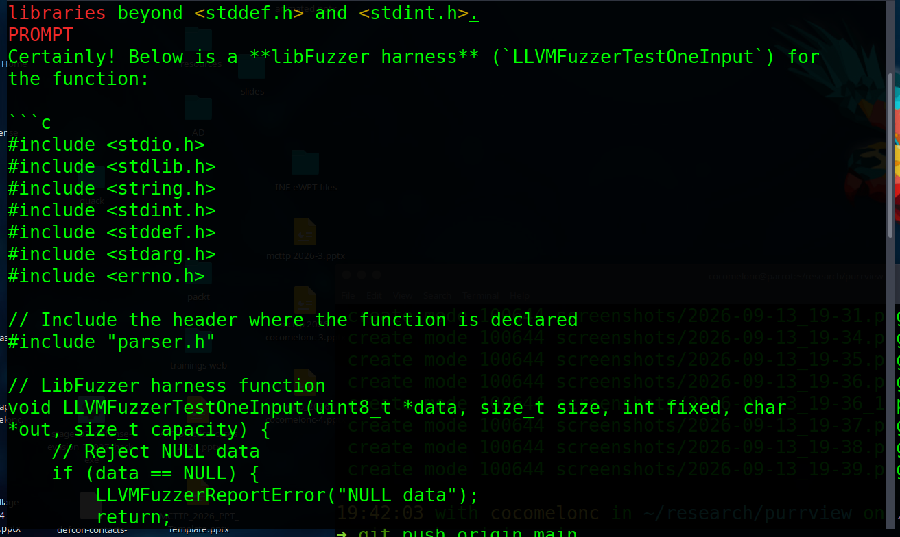     

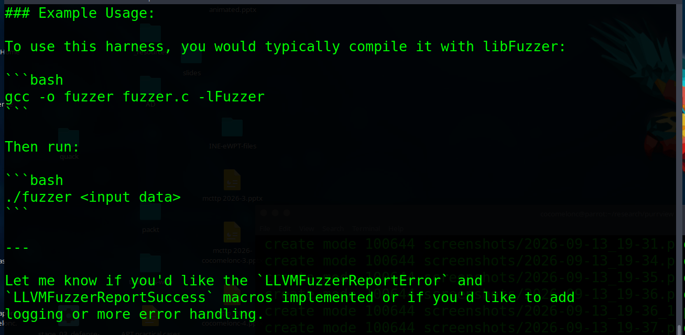     

`--think=false` matters here: without it qwen3 narrates a long, often
confused chain of thought before ever reaching code (it visibly second
guesses what `out`/`capacity` are for) - the same latency/verbosity problem
`tools/ai_mutate.py` works around by sending `"think": false` to the API.

     

     

The draft needs the same review any generated code gets here: confirm the
signature and header match `parser.h` exactly, confirm no capability the
prompt didn't ask for slipped in (file I/O, `system()`, network), and confirm
the size bounds match what the parser itself expects. The reviewed harness
is checked in; build and run it exactly like the vendored ones:

```bash
./tools/build_purrview_png_fuzzer.sh app/src/main/assets/purrview-oob.png
```

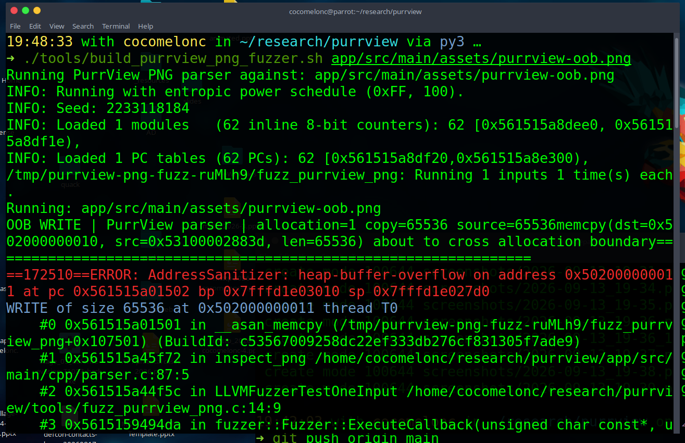     

That single-fixture run reports the same heap-buffer-overflow the Android
`:png_decoder` worker hits, straight from AddressSanitizer. Drop the fixture
argument to run a short standalone campaign instead (`libFuzzer` mutates its
own corpus and writes any crash it finds to `./crash-*`):

```bash
MAX_TOTAL_TIME=30 ./tools/build_purrview_png_fuzzer.sh
```

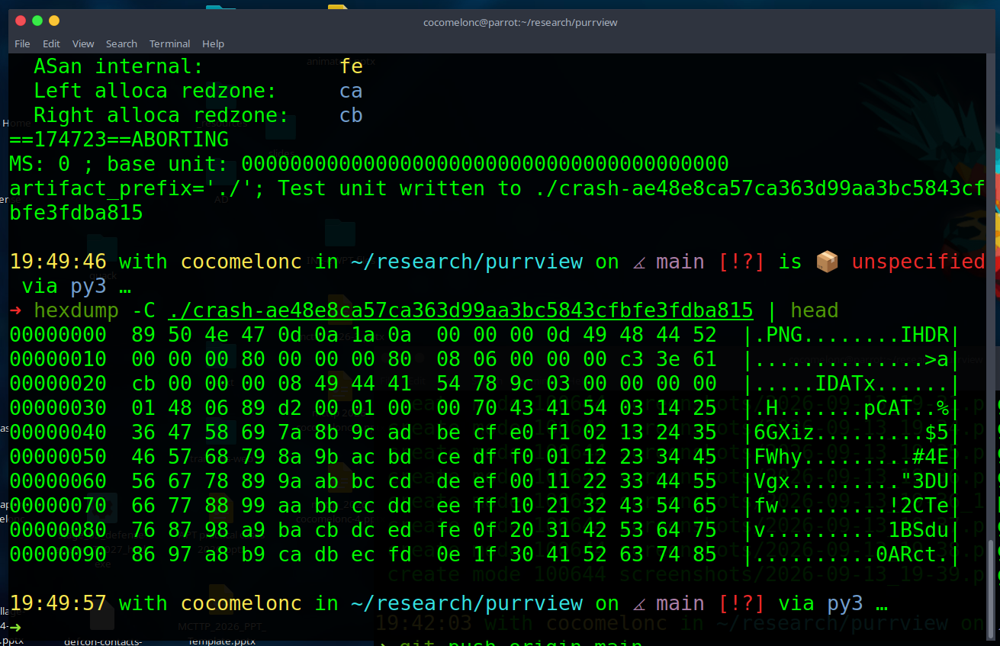     

A minute of local mutation from the one-fixture seed corpus is enough to
rediscover the same overflow without being told where it is.

## AI-assisted method selection (validation agent)

The tools above each run one fixed check. `tools/purr_agent.py` is the layer
above them: instead of a single hard-coded probe it exposes a *registry* of
bounded validation methods across three areas - exploitability, ASLR, and the
read/write primitive - and lets a model choose, from a closed allow-list,
which `method_id` to run next and with which (also allow-listed) parameters.
This is the strategy layer, not another text mutator: the agent picks a
verification method, compares independent evidence sources, and adapts the
next step to what it has already seen.

Every method in the registry carries the same metadata (`--list` prints it
all as JSON): `method_id`, `area`, `prerequisites`, estimated `cost_s` and
`timeout_s`, the `evidence` type it yields, a `risk` level, and its
success/uncertainty criteria. The methods are:

* **exploitability** - `canary_readback` (OOB read discloses the known
  post-buffer secret), `boundary_probing` (locate the CONTROL->OOB_WRITE
  height boundary), `crash_reproducibility` (repeat the abort),
  `controlled_state_impact` (bounded write changes exactly its window),
  `restart_stability` (main UI survives a worker abort);
* **aslr** - `maps_vs_dladdr` (external `/proc/maps` base vs the app's own
  dladdr self-check), `maps_snapshot` (single base read), `repeated_launch`
  (base distribution across relaunches), `crash_artifact_correlation`
  (deliberately weak, so the planner has something to skip);
* **rw** - `bounded_memory_canary`, `file_canary`, `offset_length_boundary`
  (windows accepted up to and rejected past the 64-byte companion buffer),
  `repeatability`.

One entry point runs the whole loop: **plan** (the model returns only a JSON
selection) -> **run** the bounded method -> collect typed evidence -> if the
area is still inconclusive and budget remains, **plan the next method** -> ...
-> **final per-area verdict and overall score**. The model never emits code,
payloads, offsets outside the fixed buffers, commands, URLs, or addresses - it
returns exactly this shape, validated against the registry before anything
runs (anything outside the allow-list is dropped and a deterministic
rule-based planner takes over, the same way `ai_mutate.py` falls back on a
recipe):

```json
{"select": [{"area": "aslr", "method_id": "maps_vs_dladdr"},
            {"area": "exploitability", "method_id": "canary_readback"}],
 "skip":   [{"method_id": "restart_stability",
             "reason": "unnecessary after deterministic replay"}],
 "reason": "cross-check runtime base before bounded validation",
 "confidence": 0.82}
```

The run shows not just the result but the model's decision each round - what
it selected, what it skipped and why, and its confidence:

```
== round 1 == [ollama-local:llama3.2:3b]
AI selected: maps_vs_dladdr
Skipped: restart_stability — no direct evidence for stability impact
Skipped: crash_artifact_correlation — artifact correlation alone is insufficient
Reason: direct evidence preferred, skipping methods without direct impact
Confidence: 0.82
  -> maps_vs_dladdr [base_agreement/live]: inconclusive (conf=0.25) — need both
     the external /proc/maps read and the app's dladdr self-check
```

Two modes. `--simulate` (default) needs no device: every method returns
honest, deterministic evidence derived from PurrView's *own* construction -
the fixed leak secret, the exact bypass-probability model, the toy ASLR
search - the same basis `aslr_oracle.py --simulate` and `ai_mutate.py
--density` already use, so it rehearses offline and is unit-tested.

```sh
# offline rehearsal, deterministic rule-based planner (no model, no device):
python3 tools/purr_agent.py --simulate --offline

# offline, but let a local Ollama model drive the selection:
python3 tools/purr_agent.py --simulate --no-remote --local-model llama3.2:3b
```

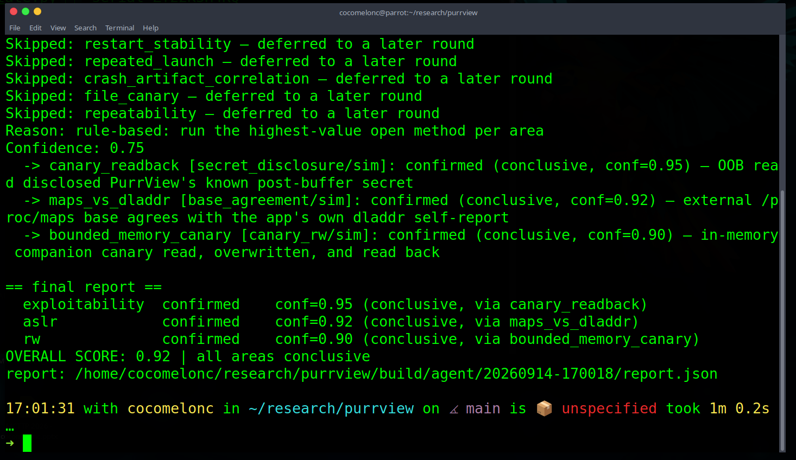     

`--live` wires the methods to a real device over the same adb/logcat/oracle
paths the other tools use. The exploitability OOB methods reuse
`AiSweepReceiver`; the ASLR self-check and the read/write primitive are driven
by a second bounded, debuggable-only receiver, `LabControlReceiver`, added so
the agent can trigger them from adb with no human tapping a button. It takes no
arbitrary path, offset or payload from the broadcast - `ASLR_SELFCHECK` runs
the same `dladdr()` self-report the button runs (in the main process, logging
`PurrView/ASLR`), and `RW_START` starts the R/W worker against PurrView's own
already-private `files/purrview-rw.png` with a target constrained to exactly
`memory` or `file`. The two host-side checks (`offset_length_boundary`,
`repeatability`) stay model-derived and say so. Launch PurrView first so its
process and `libpurrview.so` mapping exist:

```sh
adb shell monkey -p lab.purrview -c android.intent.category.LAUNCHER 1
python3 tools/purr_agent.py --live --no-remote --local-model llama3.2:3b \
        --serial <device> --timeout 90
```

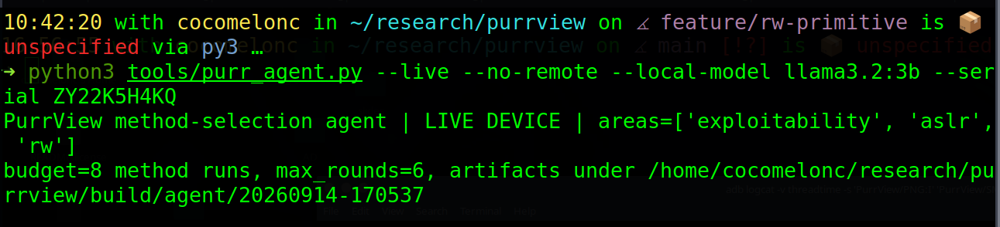     

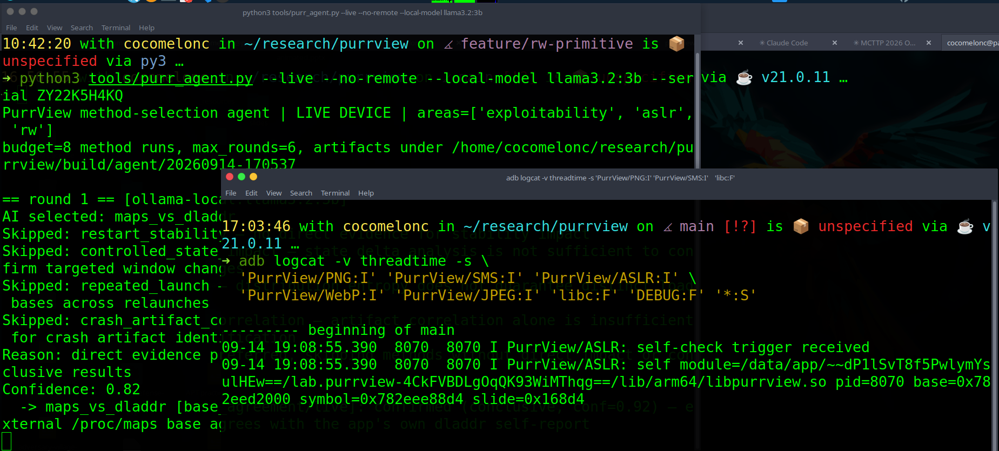     

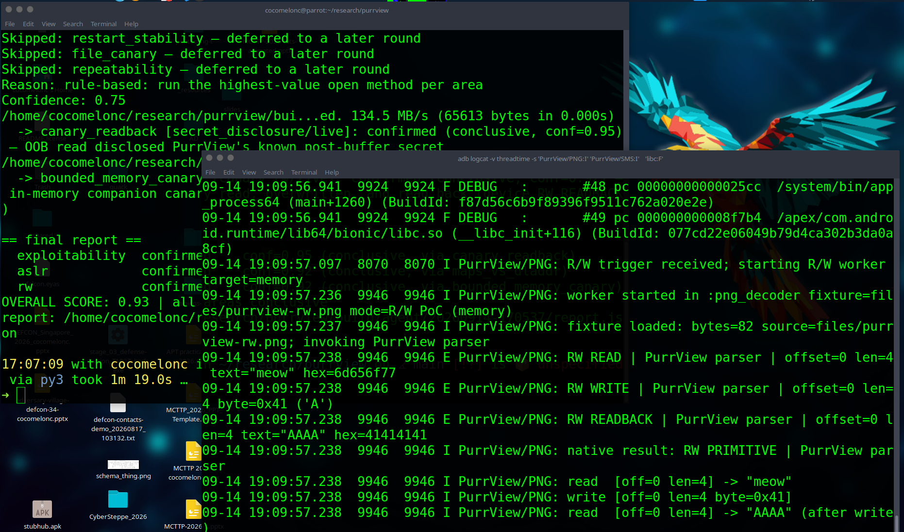     

On the Motorola every area then reaches a conclusion on real device evidence
(`simulated: false`), overall score 0.93:

* **exploitability** - `canary_readback` fires the on-device OOB read and
  discloses `meow-meow MCTTP 2026`, matching the `E/PurrView/PNG: OOB READ
  leak: meow-meow MCTTP 2026` line in logcat;
* **aslr** - `maps_vs_dladdr` broadcasts the self-check, then reads the same
  pid's `/proc/<pid>/maps`: the app's own dladdr base and the external reader
  agree on `0x782eed2000` - two independent readers, one real randomized base;
* **rw** - `bounded_memory_canary` pushes an R/W fixture and reads the device's
  own `RW READBACK` line: the companion window that read back `6d656f77`
  (`meow`) reads back `41414141` after the bounded write (`file_canary` does
  the same against `RW FILE READBACK`).

Every run writes a `report.json` (per-round plan source, each evidence record
with its `simulated` flag, per-area verdicts, overall score) under
`build/agent/<timestamp>/`.

## Build and tests

The checkout uses Android Gradle Plugin/Gradle 8.10, JDK 17, NDK
27.3.13750724 and CMake 3.22.1. No GPU or network download is required.

```sh
JAVA_HOME=/usr/lib/jvm/java-17-openjdk-amd64 ./gradlew --offline --no-daemon assembleDebug
python3 -m unittest discover -s tests -v
```

The parser unit tests compile the PNG envelope parser on the host. Android
logging has a stderr fallback so those tests remain portable.

## Source map

- `app/src/main/java/lab/purrview/MainActivity.java` - centered cat UI and worker controls.
- `app/src/main/java/lab/purrview/PngDecodeService.java` - isolated PNG worker.
- `app/src/main/java/lab/purrview/SmsDecodeService.java` - isolated local PDU worker.
- `app/src/main/java/lab/purrview/WebpDecodeService.java` - libwebp worker.
- `app/src/main/java/lab/purrview/JpegDecodeService.java` - libjpeg-turbo worker.
- `app/src/main/cpp/parser.c` - PNG envelope checks and PurrView OOB/fixed paths; the `BUDGET BYPASS` path also demonstrates a bounded OOB-read leak of a fixed secret placed next to the narrow allocation; `inspect_png_rw`/`inspect_png_rw_file` are the non-crashing, attacker-offset-controlled read/write primitive (heap and file-backed), driven by `--target rw`.
- `app/src/main/cpp/sms_parser.c` - local PDU parser and OOB/fixed paths.
- `app/src/main/cpp/bridge.c` - self-ASLR `dladdr` JNI bridge.
- `app/src/main/cpp/png_jni.c`, `sms_jni.c` - bounded JNI entry points.
- `app/src/main/cpp/jpeg_bridge.c`, `webp_bridge.c` - native codec bridges.
- `tools/generate_samples.py` - deterministic `purrview-oob.png` and `purrview-pdu.bin` generation.
- `tools/ai_mutate.py` - bounded Ollama/fallback recipe selection, deterministic fixture builder, diff manifest and optional `adb push`; `--sweep N` drives N live recipes against a real device via `AiSweepReceiver` and classifies each from logcat; `--density N` derives the PNG worker's exact bypass probability and validates it against N live device draws, comparing a true-random arm against an Ollama-chosen arm.
- `app/src/main/java/lab/purrview/AiSweepReceiver.java` - a deliberate, bounded exported component, added so `--sweep` can trigger `PngDecodeService` from adb with no human tapping a button between recipes.
- `app/src/main/java/lab/purrview/LabControlReceiver.java` - a second bounded, debuggable-only exported receiver for `tools/purr_agent.py`'s live methods: `ASLR_SELFCHECK` runs the `dladdr` self-report in the main process (so `maps_vs_dladdr` can cross-check it), and `RW_START` runs the read/write primitive against the already-private `files/purrview-rw.png` (target constrained to `memory`/`file`); neither takes an arbitrary path/offset/payload from the broadcast.
- `tools/fuzz_purrview_png.c`, `build_purrview_png_fuzzer.sh` - libFuzzer/ASan harness for `parser.c`'s `inspect_png`, drafted with local Ollama and reviewed by hand.
- `tools/aslr_oracle.py` - external `/proc`-based reader of PurrView's own real, running-process ASLR base (via `adb ... run-as`), cross-checked against the on-device self-check; `--simulate` keeps the old offline toy search for rehearsal without hardware.
- `tools/purr_agent.py` - the AI-assisted method-selection agent: a registry of bounded validation methods across exploitability/ASLR/rw (each with prerequisites, cost/timeout, evidence type, risk and success criteria), a model that selects only `method_id` + allow-listed params, and a plan->run->re-plan loop that emits per-area verdicts and an overall score; `--simulate` (default) is offline and deterministic, `--live` wires the exploitability, ASLR and read/write methods to a real device (via `AiSweepReceiver` and `LabControlReceiver`), and reuses `ai_mutate.py`/`aslr_oracle.py` plumbing.
- `recon/` - **ReconCat**, a standalone app (`lab.reconcat`) separate from PurrView, played as the attacker's recon step; `ReconReceiver.java` logs a public, permission-free `Build.*` snapshot on an adb broadcast, which `tools/ai_mutate.py` reads back from logcat as a live `--profile`.

The reference projects and private telemetry remain outside this checkout.
